### **2.8.2 The Cytoplasm: The City Grounds**

If the nucleus is the City Hall and the membrane is the border, the **cytoplasm** is everything else! It’s the bustling city grounds—a semi-liquid, watery, and mostly transparent substance where all the real work gets done. It's not static; the living cytoplasm is always moving, a bit like a slowly swirling gel.

All the important cell organelles are found floating and working within the cytoplasm. Let's take a tour of these incredible "little organs"!

```mermaid
flowchart TB
    subgraph CELL["🧫 CELL – The Unit of Life"]

      %% Boundaries
      WALL["🧱 Cell Wall (Plants only)<br/>• Rigid support<br/>• Made of cellulose<br/>• Freely permeable"]
      MEMB["🚪 Cell Membrane<br/>• Selective barrier<br/>• Controls entry/exit<br/>• Present in all cells"] 

      %% Cytoplasm
      CYTO["💧 Cytoplasm<br/>• Jelly-like medium<br/>• Site of reactions<br/>• Holds organelles"]

      %% Nucleus
      subgraph NUC["🏛️ Nucleus (Control Center)"]
        NUCMEM["Nuclear Membrane<br/>• Double layered<br/>• Has pores"]
        NUCLEOL["Nucleolus<br/>• Makes ribosomes"]
        CHROM["Chromatin (DNA + proteins)<br/>• Genes<br/>• Forms chromosomes"]
      end

      %% Core organelles
      RIBO["🔬 Ribosomes<br/>• Protein factories<br/>• Free or on Rough ER"]
      RER["🛤️ Rough ER<br/>• Ribosomes attached<br/>• Transports proteins"]
      SER["🛤️ Smooth ER<br/>• Makes fats/lipids<br/>• Detoxifies poisons"]
      GOLGI["📦 Golgi Apparatus<br/>• Modifies & packages proteins<br/>• Dictyosomes in plants"]
      MITO["⚡ Mitochondria<br/>• Powerhouse<br/>• Makes ATP<br/>• Has own DNA"]
      LYSO["🧹 Lysosomes (Animals only)<br/>• Digest waste<br/>• Suicide bags"]
      CENTRO["🎯 Centrosome (Animals only)<br/>• Centrioles<br/>• Cell division (spindle)"]

      %% Plant-only
      CHLORO["🌿 Chloroplasts<br/>• Photosynthesis<br/>• Chlorophyll"]
      CHROMOP["🎨 Chromoplasts<br/>• Pigments (carotene, xanthophyll)<br/>• Color to fruits/flowers"]
      LEUCO["⚪ Leucoplasts<br/>• Colorless<br/>• Store starch/fats"]

      %% Storage
      VACU["🛢️ Vacuoles<br/>• Storage sacs<br/>• Large in plants<br/>• Small in animals"]
      GRAN["🍚 Granules<br/>• Stored starch/glycogen/fats<br/>• Non-living inclusions"]

    end

    %% Logical relationships (minimal)
    NUC --> RIBO
    RIBO --> RER
    RER --> GOLGI
    MITO -.->|"ATP energy"| RIBO
    MITO -.->|"ATP energy"| RER
    MITO -.->|"ATP energy"| GOLGI
    CHLORO -.->|"Glucose"| MITO
    CENTRO -.->|"Helps division"| NUC
    VACU -.->|"Stores sap/water"| CYTO
    GRAN -.->|"Stores food"| CYTO
    LYSO -.->|"Waste recycling"| CYTO


```

**1. Endoplasmic Reticulum (ER): The City's Highway & Factory Network**
Imagine a massive, interconnected network of roads and tunnels spreading throughout the entire city. That's the **Endoplasmic Reticulum (ER)**. It's an irregular network of tubes and sheets made of double membranes.
*   **Structure:** It’s so fine you can only see it with an electron microscope. It connects the outer cell membrane to the nuclear membrane on the inside, forming a complete transport system.
*   **Function:** It acts as a **supporting framework** (like scaffolding) for the cell and serves as a **pathway** for distributing materials from one place to another.

There are two types of ER, which look different and have different jobs:
*   **Rough ER:** This looks "rough" because its surface is dotted with tiny granules called **ribosomes**. This is the industrial part of the highway, where proteins are made.
*   **Smooth ER:** This has no ribosomes, so it looks "smooth." It's involved in making fats and other substances.

**2. Ribosomes: The Protein Factories**
These are the most important factories in our city. **Ribosomes** are tiny, numerous granules. You can find them either scattered freely in the cytoplasm or attached to the Rough ER.
*   **Function:** Their one and only job is to be the site of **protein synthesis**. They read instructions from the nucleus and build all the proteins the cell needs to live and grow. No ribosomes, no proteins, no life!

**3. Mitochondria: The Powerhouses of the Cell**
Every city needs electricity. The **Mitochondria** (singular: mitochondrion) are the power plants.
*   **Structure:** They are spherical or rod-shaped, double-walled bags. The inner wall is folded into finger-like projections called **cristae**, which increases the surface area for energy production.
*   **Function:** This is the site of **cellular respiration**. Mitochondria take in food (like glucose) and oxygen and "burn" them to release a huge amount of energy. This energy is then stored in a special molecule called **ATP (Adenosine Triphosphate)**.
*   **Nickname:** Because they produce and store the cell's energy, they are famously called the **"powerhouses of the cell"**. ATP is known as the **"energy currency"**—the cell "spends" ATP to get any work done.
*   **Special Trait:** Mitochondria contain their own DNA and can make copies of themselves!

**4. Golgi Apparatus: The Packaging & Shipping Department**
Once proteins are made in the factories (ribosomes), where do they go? They are sent to the **Golgi Apparatus** (also called Golgi Complex or Golgi Body).
*   **Structure:** A stack of flattened sacs (cisternae) and small bubbles (vesicles), which often originates from the ER. In plants, they are usually smaller and more scattered, and are called **dictyosomes**.
*   **Function:** Think of it as the city's post office or courier service. It receives proteins and other materials from the ER, modifies them, **packages** them into vesicles, and **transports** them to their final destination—either inside or outside the cell. It is especially important for cells that have a lot of **secretions**, like enzymes and hormones.
*   **Special Role (Animals):** It helps in the **formation of the acrosome**, the special tip of a sperm cell that helps it penetrate the egg.

**5. Lysosomes: The Cleanup Crew & Demolition Squad**
Every city produces trash and has old buildings that need to be torn down. This is the job of the **Lysosomes**.
*   **Structure:** Small, bubble-like vesicles filled with powerful **digestive enzymes**.
*   **Functions:**
    1.  **Defense:** They destroy foreign invaders like bacteria that enter the cell.
    2.  **Digestion:** They break down stored food during times of starvation.
    3.  **Demolition:** If a cell is old, damaged, or infected, the lysosomes can burst and release their enzymes to digest the entire cell from the inside out! This controlled self-destruction is why they are nicknamed the **"suicide bags"** of the cell.

**6. Centrosome & Centrioles: The Cell Division Organizers (Animals Only!)**
This is a special structure found **only in animal cells**.
*   **Structure:** The **centrosome** is an area near the nucleus that contains two tiny, barrel-shaped structures called **centrioles**. These two centrioles are always arranged at **right angles** to each other.
*   **Function:** They play a crucial role during **cell division**. When an animal cell is ready to divide, the centrosome helps to form thin **spindle fibres** that pull the copied chromosomes apart, ensuring each new cell gets a perfect set.

**7. Plastids: The Specialized Workshops (Plants Only!)**
These are a diverse group of organelles found **only in plant cells**. They are the plant's specialists for making food and storing it. They are classified by their color (or lack of it).

*   **(a) Leucoplasts (The Storage Warehouses):**
    *   *Leuco* means *white*. These are **colorless** plastids.
    *   Their job is to **store food**, usually in the form of **starch**. A potato is packed full of cells that are stuffed with leucoplasts.

*   **(b) Chromoplasts (The Paint Shop):**
    *   *Chromo* means *color*. These plastids contain pigments that give flowers and fruits their beautiful colors.
    *   They contain pigments like **xanthophyll (yellow)** and **carotene (orange-red)**. The color of a carrot or a marigold flower comes from its chromoplasts.

*   **(c) Chloroplasts (The Solar Power Food Factories):**
    *   *Chloro* means *green*. These are the most famous plastids. They contain the green pigment **chlorophyll**.
    *   **Function:** This is the site of **photosynthesis**. They trap solar energy and use it to turn carbon dioxide and water into food (carbohydrates).
    *   **Important Note:** It's wrong to call them the "kitchen of the cell." A kitchen is where you cook pre-existing food. A chloroplast *produces* the food from scratch!
    *   **Special Trait:** Like mitochondria, chloroplasts have their own DNA and can divide.

> **Real-Life Connection: Green to Red!**
> Why do raw tomatoes or chillies turn from green to red when they ripen? When unripe, their cells are full of green **chloroplasts**. As they ripen, the chlorophyll breaks down, unmasking the red and orange pigments (**carotene**) in the **chromoplasts** that were there all along!

---
**The "Junk in the Trunk": Non-Living Inclusions**

Floating in the cytoplasm, we also find things that aren't living organelles. These are **non-living substances** called **cell inclusions**. Think of them as storage piles or waste dumps.

1.  **Granules:** These are small particles of stored food, like **starch**, **glycogen** (animal starch), or **fats**.
2.  **Vacuoles (The Water Tank / Storage Room):**
    *   These are clear, membrane-bound sacs in the cytoplasm.
    *   In **animal cells**, they are small and temporary, if present at all.
    *   In **plant cells**, they are huge! A mature plant cell usually has one massive central vacuole that can take up most of the cell's space. It's filled with a liquid called **cell sap** (water, sugars, salts, and waste). This giant water-filled vacuole pushes against the cell wall, keeping the cell firm and turgid.
---
Of course! This is a brilliant and absolutely essential step. Knowing the individual organelles is like knowing the actors in a play. Understanding how they interact is like understanding the plot itself. This is what separates simple memorization from true biological understanding.

I will create a special section called **"Cell City at Work: The Story of a Protein."** This story will follow the journey of creating and exporting a single protein, showing how all the major organelles must collaborate perfectly. This narrative format makes the relationships much easier to remember than a simple list.

Here is the new documentation, designed to be slotted in right after the "Quick Exam Revision Zone" for section 2.8.2.

***

### **Cell City at Work: How the Organelles Collaborate**

Think of the organelles we just learned about not as separate items on a list, but as a team working on a big project. The most important project in any cell is **making and using proteins**. Proteins are the building blocks and the machines that do almost everything.

Let's follow the life story of one important protein—let's say it's a digestive enzyme that needs to be shipped *out* of the cell.

**The Project: "Operation: Make & Export Enzyme"**

**Step 1: The Master Plan (Nucleus)**
*   The project starts in the **NUCLEUS** (the City Hall). The master blueprint for the enzyme protein (which is a segment of **DNA**) is located here.
*   The Nucleus makes a temporary copy of the blueprint, called **mRNA**. Think of this as a work-order or a memo. This mRNA message then leaves the Nucleus and travels into the cytoplasm.

**Step 2: The Factory Floor (Ribosomes & ER)**
*   The mRNA work-order arrives at a **RIBOSOME** (the Protein Factory).
*   This ribosome is sitting on the surface of the **ROUGH ENDOPLASMIC RETICULUM (ER)** (the Factory Highway).
*   The **RIBOSOME** reads the mRNA instructions and starts building the enzyme protein, piece by piece. As it's being built, the protein chain is threaded directly *inside* the tunnels of the **ROUGH ER**.

> **Relationship 1: Nucleus → Ribosome → Rough ER**
> The **Nucleus** provides the instructions, the **Ribosome** does the building, and the **Rough ER** provides the workspace and the first step of the transport path.

**Step 3: Transport & Modification (ER → Golgi)**
*   The newly made protein now travels through the maze-like tunnels of the **ER**, like a product on a conveyor belt.
*   At the end of the ER highway, a small bubble of membrane called a transport **vesicle** pinches off, carrying the protein inside.
*   This vesicle travels a short distance through the cytoplasm and fuses with the **GOLGI APPARATUS** (the Post Office).

> **Relationship 2: Rough ER → Golgi Apparatus**
> The **ER** sends the newly made, raw protein to the **Golgi Apparatus** for final processing and packaging.

**Step 4: Packaging & Shipping (Golgi → Cell Membrane)**
*   Inside the **GOLGI APPARATUS**, the protein is finalized. It might be folded into its final 3D shape or have other small molecules attached.
*   The Golgi then packages the finished enzyme into another clean, new **vesicle**. This is like putting the product in a labeled shipping box.
*   This final vesicle moves to the edge of the cell and fuses with the **CELL MEMBRANE** (the City Border), releasing the enzyme outside the cell to do its job.

> **Relationship 3: Golgi Apparatus → Cell Membrane**
> The **Golgi** packages the finished product and ships it to the **Cell Membrane** for export.

**The Unsung Hero: The Powerhouse (Mitochondria)**

*   None of these steps—not making the mRNA, not building the protein, not packaging it—could happen without energy.
*   All the while, the **MITOCHONDRIA** (the Powerhouses) are busy performing cellular respiration, producing a constant supply of **ATP** (energy currency). This ATP powers the Ribosomes, the Golgi, and all other active processes in the cell.

> **Relationship 4: Mitochondria → All other Organelles**
> The **Mitochondria** don't participate directly in the protein's journey, but they provide the **energy (ATP)** that fuels every single step.

**The Cleanup Crew (Lysosomes)**

*   What if a protein is made incorrectly? Or what if an old organelle, like a mitochondrion, stops working efficiently?
*   The **LYSOSOMES** (the Cleanup Crew) are on patrol. They will find and digest the faulty protein or the worn-out organelle, recycling its raw materials for the cell to use again.

> **Relationship 5: Lysosomes → All other Organelles**
> The **Lysosomes** are responsible for quality control and recycling, breaking down old or faulty components to keep the cell clean and efficient.

By following this one story, you can now see how the Nucleus, Ribosomes, ER, Golgi, Mitochondria, and Lysosomes are all part of one interconnected, dynamic, and collaborative team.

```mermaid
flowchart TD
    A["🏛️ NUCLEUS<br/>• Contains DNA (genes)<br/>• Has nucleolus<br/>• Makes mRNA"]
    
    B["🔬 RIBOSOMES<br/>• Make proteins<br/>• Found free or on Rough ER<br/>• Use mRNA instructions"]
    
    C["🛤️ ROUGH ER<br/>• Has ribosomes attached<br/>• Transports proteins<br/>• Part of ER system"]
    
    D["📦 GOLGI APPARATUS<br/>• Packages proteins<br/>• Modifies proteins<br/>• (Dictyosomes in plants)"]
    
    E["⚡ MITOCHONDRIA<br/>• Makes ATP energy<br/>• Has own DNA<br/>• Double membrane with cristae"]
    
    F["🧹 LYSOSOMES<br/>• Digest waste<br/>• Clean up faulty proteins<br/>• (Animals only)"]
    
    G["🚪 CELL MEMBRANE<br/>• Controls entry/exit<br/>• Releases proteins outside"]

    %% Protein pathway
    A -->|"mRNA leaves nucleus"| B
    B -->|"Protein chain built"| C  
    C -->|"Protein folded & moved in vesicles"| D
    D -->|"Packaged proteins in vesicles"| G
    G -->|"Exocytosis"| OUT["🌍 OUTSIDE CELL<br/>Protein released"]

    %% Energy
    E -.->|"ATP supply"| A
    E -.->|"ATP supply"| B
    E -.->|"ATP supply"| C
    E -.->|"ATP supply"| D
    
    %% Cleanup
    F -.->|"Removes faulty proteins"| C
    F -.->|"Cleans up waste"| D

    %% Summary
    H["📚 ICSE SUMMARY:<br/>• DNA → mRNA → Protein<br/>• Each organelle has a role<br/>• Mitochondria fuels all<br/>• Lysosomes clean up<br/>• Plants also use plastids (not shown)"]

    %% Styling
    classDef nucleus fill:#e8f4fd,stroke:#1565c0,stroke-width:3px
    classDef protein fill:#fff3e0,stroke:#ef6c00,stroke-width:3px  
    classDef energy fill:#f1f8e9,stroke:#558b2f,stroke-width:3px
    classDef cleanup fill:#fce4ec,stroke:#ad1457,stroke-width:3px
    classDef membrane fill:#f3e5f5,stroke:#6a1b9a,stroke-width:3px
    classDef summary fill:#e0f2f1,stroke:#00695c,stroke-width:2px
    classDef output fill:#ffebee,stroke:#c62828,stroke-width:2px

    class A nucleus
    class B,C,D protein
    class E energy
    class F cleanup
    class G membrane
    class H summary
    class OUT output


```

---
### **⚡️ Quick Exam Revision Zone ⚡️**

**Living vs. Non-Living Parts of a Cell (Summary Table)**

| Category | Living Parts (Organelles) | Non-Living Parts (Inclusions & Structures) |
| :--- | :--- | :--- |
| **Boundaries** | Cell Membrane | Cell Wall (Plant only) |
| **In Cytoplasm** | Endoplasmic Reticulum (ER), Ribosomes, Mitochondria, Golgi Apparatus, Lysosomes | Granules, Vacuoles, Fat Droplets |
| **- Animal Only** | Centrosome (with Centrioles) | - |
| **- Plant Only** | Plastids (Chloroplast, Chromoplast, Leucoplast) | - |
| **In Nucleus** | Nuclear Membrane, Nucleolus, Chromatin Fibres | Nucleoplasm (the jelly-like fluid) |

**Organelle Nicknames & Key Functions (MEMORIZE THIS!)**

| Organelle | Nickname / Key Role | Function | Plant/Animal/Both? |
| :--- | :--- | :--- | :--- |
| **Ribosome** | Protein Factory | Site of protein synthesis. | Both |
| **Mitochondria** | Powerhouse | Cellular respiration, produces ATP (energy). | Both |
| **Golgi Apparatus** | Post Office / Packaging | Packages & transports secretions (proteins, etc). | Both |
| **Lysosome** | Suicide Bag / Cleanup Crew | Digests waste, foreign bodies, and old cells. | Both (mainly animal) |
| **Centrosome** | Cell Division Organizer | Forms spindle fibres for cell division. | **Animal Only** |
| **Chloroplast** | Solar Food Factory | Photosynthesis (makes food). | **Plant Only** |
| **Leucoplast** | Storage Warehouse | Stores starch. | **Plant Only** |
| **Chromoplast** | Paint Shop | Contains colored pigments for fruits/flowers. | **Plant Only** |
| **Vacuole** | Water Tank | Stores cell sap, provides turgidity. | Both (large in plant) |

You are now ready to tackle the final part of the cell city: the main office, the **Nucleus**! Let me know when you're ready to proceed.
