### **2.11 PROKARYOTIC vs. EUKARYOTIC CELLS: The Two Empires of Life**

Imagine all living things on Earth belong to one of two great empires. The basis for this division is incredibly simple: how they store their "master blueprints" (their genetic material). This is the most fundamental difference in all of biology.

The names of these two empires come from Greek:
*   ***Karyon*** means "kernel" or "nucleus."
*   ***Pro*** means "before" or "primitive."
*   ***Eu*** means "true" or "complete."

**The First Empire: The Prokaryotes (The "Primitive Nucleus" Empire)**

These are the pioneers of life, the earliest and simplest cells to have evolved. Think of them as tiny, efficient, one-room studio apartments.
*   Their defining feature is that they have **NO true nucleus**. There is no "City Hall" building.
*   Their genetic material, a single loop of **DNA**, simply floats in the middle of the cytoplasm in a region called the **nucleoid**.
*   They are minimalist. They lack most of the other membrane-bound organelles we've studied, like mitochondria, ER, and Golgi bodies. They have **ribosomes** (for making proteins), but these are smaller than in more advanced cells.
*   **Examples:** The most famous prokaryotes are **Bacteria** and **Blue-green algae (Cyanobacteria)**.

**The Second Empire: The Eukaryotes (The "True Nucleus" Empire)**

These are the more advanced, complex cells that evolved later. Think of them as sprawling, organised cities with many different departments.
*   Their defining feature is a **well-defined, true nucleus**, protected by a nuclear membrane. The "City Hall" is a secure, separate building.
*   Their genetic material is much more extensive, organised into multiple **chromosomes** (DNA wound around proteins).
*   They are full of specialised departments—all the **organelles** we toured, like mitochondria, ER, chloroplasts (in plants), lysosomes, etc.
*   Their ribosomes are larger and more complex.
*   **Examples:** Everything you can see with your naked eye! **All plants, all animals**, fungi, and protists like Amoeba are eukaryotes. You are a eukaryote.

This division is the very first step scientists take when classifying any organism. First, they ask: "Is it a Prokaryote or a Eukaryote?"

```mermaid
graph TD
    A["🌍 ALL LIFE ON EARTH<br/>Two Great Empires<br/>Based on nucleus presence"] 
    
    A -->|"First to evolve<br/>Simple structure"| B["🏠 PROKARYOTIC EMPIRE<br/>Pro = Before/Primitive<br/>Karyon = Nucleus<br/>NO TRUE NUCLEUS"]
    
    A -->|"Evolved later<br/>Complex structure"| C["🏙️ EUKARYOTIC EMPIRE<br/>Eu = True/Complete<br/>Karyon = Nucleus<br/>TRUE NUCLEUS PRESENT"]
    
    B -->|"Single DNA loop<br/>in nucleoid region"| D["🦠 BACTERIA<br/>• No nuclear membrane<br/>• DNA floats freely<br/>• Small ribosomes<br/>• No organelles"]
    
    B -->|"Photosynthetic<br/>prokaryotes"| E["🌊 CYANOBACTERIA<br/>Blue-green algae<br/>• Make their own food<br/>• No chloroplasts<br/>• Ancient oxygen producers"]
    
    C -->|"Multicellular<br/>eukaryotes"| F["🌿 PLANTS<br/>• Cell wall (cellulose)<br/>• Chloroplasts<br/>• Large vacuole<br/>• All organelles"]
    
    C -->|"Multicellular<br/>eukaryotes"| G["🦁 ANIMALS<br/>• No cell wall<br/>• No plastids<br/>• Small vacuoles<br/>• All organelles"]
    
    C -->|"Mostly single-celled<br/>eukaryotes"| H["🦠 PROTISTS<br/>Example: Amoeba<br/>• Nucleus present<br/>• Various organelles<br/>• Diverse group"]
    
    C -->|"Multicellular<br/>eukaryotes"| I["🍄 FUNGI<br/>• Cell wall (chitin)<br/>• No chloroplasts<br/>• Absorb nutrients<br/>• All organelles"]
    
    style A fill:#e1f5fe
    style B fill:#fff3e0
    style C fill:#e8f5e8
    style D fill:#fff3e0
    style E fill:#fff3e0
    style F fill:#e8f5e8
    style G fill:#e8f5e8
    style H fill:#e8f5e8
    style I fill:#e8f5e8
```

---
### **⚡️ Quick Exam Revision Zone ⚡️**

**Table 2.3: Differences between Prokaryotic and Eukaryotic Cells (CRUCIAL FOR EXAMS!)**

| Feature | **Prokaryotic Cell** (Simple Studio Apartment) | **Eukaryotic Cell** (Complex City) |
| :--- | :--- | :--- |
| **1. Nucleus** | **Absent.** Genetic material is in a **nucleoid** region. | **Present.** A true nucleus with a nuclear membrane. |
| **2. Genetic Material** | A single, simple loop of **DNA**. | Multiple **chromosomes** (DNA + proteins). |
| **3. Organelles** | **Absent.** No mitochondria, ER, Golgi, etc. | **Present.** Full of membrane-bound organelles. |
| **4. Ribosomes** | **Smaller** | **Larger** |
| **5. Examples** | **Bacteria**, Blue-green algae | **Plants, Animals**, Fungi, Amoeba |

**Memory Hook:**
*   **Pro** = **Pro**-blematic nucleus (it's missing!)
*   **Eu** = **You** are a **Eu**-karyote!

---

### **Progress Check (Quick Revision!)**

Let's test your knowledge from the last few sections.

1.  **Name the part of a cell in which...**
    *   (i) ...many chemical reactions occur with the help of enzymes: **Cytoplasm**
    *   (ii) ...a network of chromatin fibres occurs: **Nucleus**
    *   (iii) ...cellulose forms the main component: **Cell Wall** (in plants)

2.  **Differentiate between...**
    *   **(i) an organ and an organelle:**
        *   An **Organ** is a large structure made of many cells that performs a job for the whole organism (e.g., the heart pumps blood for the body).
        *   An **Organelle** is a tiny "little organ" *inside* a single cell that performs a job for that cell (e.g., the mitochondrion produces energy for the cell).
    *   **(ii) a plant cell and an animal cell regarding plastids:**
        *   **Plant cells have plastids** (like chloroplasts to make food).
        *   **Animal cells do not have plastids.**
