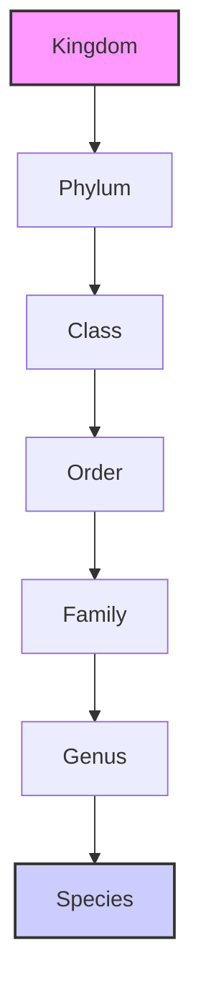

# 8.1 An Order to the Chaos of Life

"Look around you. Life is everywhere. It thrives in the deepest oceans and on the highest mountains. It can be a single, invisible bacterium in a drop of water, or a magnificent blue whale, the largest animal that has ever lived. It is the familiar bark of a dog, the silent stretch of a mango tree's branches, and the fuzzy mould that grows on a forgotten piece of bread.

This breathtaking variety is what we call **diversity**. But with millions of living things on our planet, how do we even begin to make sense of it all? Imagine a library with millions of books, but no sections, no labels, no order whatsoever. It would be chaos!

That is why, for centuries, naturalists and scientists have sought to bring order to this beautiful chaos. They group living things, not just randomly, but by looking for similarities, like assembling a giant, planetary family tree. They start with the simplest forms of life and build up, step by step, to the most complex.

To do this, they created a system of levels, like a set of nested boxes, each one fitting neatly inside the other."

"We will explore all these levels, but the journey begins with the most fundamental, the most personal box of all: the **Species**."

### What, Truly, is a Species?

"What makes a cat... a cat? You might see a ginger cat in London, a black cat in Tokyo, and a fluffy white cat in New York. They look different—different colours, different lengths of tail—but they are all, unmistakably, cats. Why? Because they can all meet, have kittens, and those kittens can grow up to have more kittens of their own.

This is the secret to the idea of a species. It’s a family of organisms so closely related that they can interbreed and produce **fertile** young.

Think of us, human beings. We live all over the world, with a wonderful variety of features, yet we are all one single species: *Homo sapiens*. We can build families together. The same is true for all the 'peepal' trees in the world, or all the mango trees. They belong to their own unique species-family.

But what happens when nature’s lines get a little blurry?"

### When Families Meet: Curious Crossings

"Consider the horse and the donkey. They look quite similar, don't they? They are two different, but very closely related, species. For centuries, humans have brought them together. When a male donkey and a female horse mate, they produce a wonderfully sturdy animal: the mule. But here is the fascinating part: the mule is sterile. It cannot have babies of its own. It is a beautiful, but final, chapter in its family line.

This tells us something profound. Nature allows these close-family crossings, but it almost always draws a line at the next generation. The offspring are invariably sterile. Here are a few other curious examples of these meetings between species:"

| Male Parent | Female Parent | Offspring Name | Fertile? | Fun Fact |
| :---------- | :------------ | :------------- | :------- | :------- |
| Zebra       | Donkey        | Zenkey         | No       | Has the striped legs of a zebra and the ears of a donkey. |
| Tiger       | Lion          | Tigon          | No       | A powerful mix of two of the world's greatest cats. |
| Goat        | Sheep         | Geep           | No       | A rare hybrid that shares traits from both parents. |

"Humans, with their own ingenuity, have even tried this with plants. By grafting a tomato plant onto a potato plant, they created the 'Pomato'—a single plant that grows tomatoes above the ground and potatoes below! But, just like the mule, it hits a genetic dead end. It produces no seeds.

These fascinating exceptions help us understand the rule. A species is a promise of continuity, a chain of life passed down through fertile generations."

***

*Isn't it amazing how life has these invisible rules that define families? It makes you wonder what other secret connections exist in the great web of life.*
