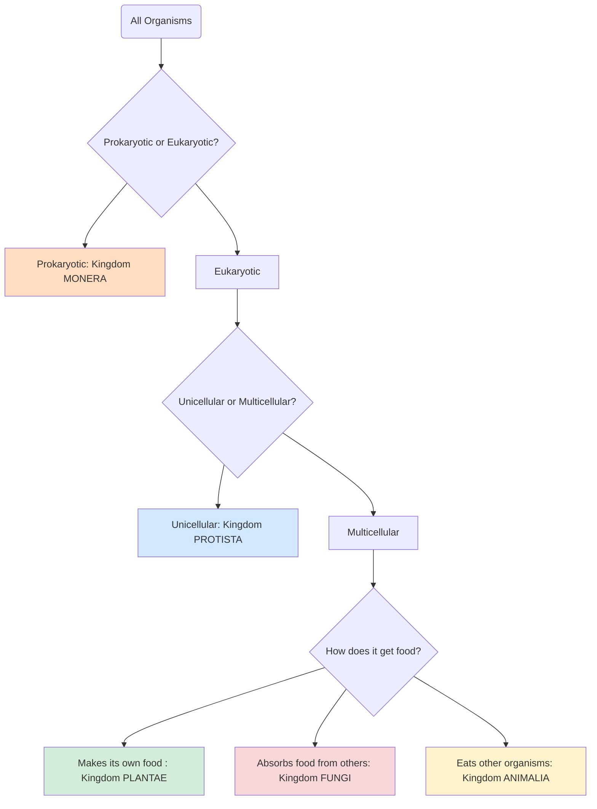

# 8.4 The Five Great Kingdoms of Life

"So, the old, simple system of just two kingdoms—plants and animals—was no longer enough. The world of the unseen, the world of the misfits, demanded a new map. And so, scientists created one. They unveiled a magnificent new chart of life, divided not into two, but into **five** great kingdoms.

Think of them as five continents, each with its own unique landscape, its own rules, and its own extraordinary inhabitants. Let's begin our journey and explore them, one by one.

---

### Kingdom 1: Monera – The Ancient Architects

"Our first stop is the kingdom of **Monera**. This is the oldest, most widespread kingdom on Earth. Its citizens are the **bacteria**. They are the true architects of our world, tiny but unbelievably powerful.

What makes them so special?

*   **They are loners:** Each bacterium is a single, self-contained cell.
*   **They are simple:** Imagine a house with no rooms, just one open space. That's a Monera cell. It has no organized center, no **nucleus**. Its genetic blueprint, its DNA, simply floats inside. Scientists have a special name for this simple design: **prokaryotic**. It means 'before the nucleus'.
*   **They travel light:** These cells don't have the complex internal machinery—like mitochondria or chloroplasts—that other cells do. They are masters of minimalism.

They are so small that millions could fit on the head of a pin, yet they are found everywhere, from the bottom of the ocean to the inside of our own bodies."

> *[See Fig. 8.3 in your textbook to see the three common shapes of these tiny architects: rods, spirals, and spheres.]*

---

### Kingdom 2: Protista – The Glorious Misfits

"Next, we journey to the kingdom of **Protista**. If Monera is the land of simplicity, Protista is the kingdom of glorious misfits and dazzling individuals. It’s a grab-bag of organisms that don't quite fit anywhere else.

What do they have in common?

*   **They have a command center:** Unlike bacteria, their cells are **eukaryotic**—meaning 'true nucleus'. Their DNA is neatly contained within a nucleus, like a brain for the cell.
*   **Most are single-celled:** But what incredible cells they are!
    *   You might find the green, plant-like *Chlamydomonas*, swimming with its little tails.
    *   Or the famous *Amoeba*, a shapeshifter that oozes its way through the water.
    *   Or the slipper-shaped *Paramecium*, covered in tiny hairs that beat like oars.
    *   And of course, the puzzling *Euglena*, the half-plant, half-animal marvel we met earlier.

This kingdom is a bustling city of single-celled wonders, a testament to life's endless creativity."

> *[Check out Fig. 8.4 in your textbook to meet these fascinating characters of the Protista kingdom.]*

---

### Kingdom 3: Fungi – The Great Recyclers

"Our third kingdom is one you know well, though you might not have thought of it this way. Welcome to the world of **Fungi**. This is the kingdom of mushrooms, moulds, and yeasts.

Fungi are nature's great recyclers. They are not plants, because they have no chlorophyll to make their own food. They are not animals, because they don't 'eat' in the way we do. Instead, they are **saprophytic**—they absorb nutrients from the world around them, often from decaying matter, breaking it down and returning it to the soil.

*   **A web of life:** Most fungi are not made of cells in the usual sense. Instead, they are built from a network of fine, thread-like structures called **hyphae**. Imagine a vast, interconnected web, with many nuclei scattered throughout.
*   **Familiar faces:** This kingdom includes the mould that grows on bread, the toadstools that pop up after rain, and the yeast that makes our bread rise.

They are the hidden network that connects the entire forest floor, the silent decomposers that keep the cycle of life turning."

> *[Fig. 8.5 in your textbook shows the beautiful and strange structures of bread mould, toadstools, and more.]*

---

### Kingdom 4: Plantae – The World Builders

"Now we arrive at a kingdom that builds the world as we know it: **Plantae**, the kingdom of plants. From the smallest moss to the tallest redwood, these are the green engines of our planet.

*   **They are team players:** Plants are **multicellular**, made of many cells working together.
*   **They are sun-catchers:** They are **autotrophic**, meaning 'self-nourishing'. Using the magic of chlorophyll and photosynthesis, they turn sunlight into energy, creating the food that fuels almost all life on Earth.

This kingdom is so vast and important that it's divided into its own great families:"

| Division      | Key Feature                                       | Common Name |
| :------------ | :------------------------------------------------ | :---------- |
| **Thallophyta** | Simple, 'thallus' body. No true roots, stem, or leaves. | Algae, Seaweeds |
| **Bryophyta**   | Has stem-like and leaf-like parts, but no true roots. | Mosses, Liverworts |
| **Pteridophyta**| Has true roots, stems, and leaves (fronds). No flowers. | Ferns       |
| **Gymnosperms** | "Naked seeds," usually in cones. No flowers or fruits. | Pine, Cycas |
| **Angiosperms** | Seeds are protected inside a fruit. The flowering plants. | Rose, Mango, Grass |

"The Angiosperms, the flowering plants, are the most advanced. They are further divided into two groups based on their seeds:
*   **Monocots:** Have one seed leaf. Think of corn, rice, and grass.
*   **Dicots:** Have two seed leaves. Think of beans, roses, and sunflowers."

> *[Explore Fig. 8.6 in your textbook to see the beautiful diversity of the plant kingdom, from simple algae to complex flowering plants.]*

---

### Kingdom 5: Animalia – The Movers and Eaters

"Our final kingdom is the one we belong to: **Animalia**, the kingdom of animals. This is the world of movement, of senses, of hunting and hiding.

*   **Complex and organized:** Animals are **multicellular**, with their cells organized into tissues, organs, and systems.
*   **They are eaters:** They are **heterotrophic**, meaning 'differently nourished'. They cannot make their own food, so they must find it, eat it, and digest it.
*   **Freedom of movement:** Most animals are mobile, able to run, fly, swim, or crawl. Even those that stay put, like sponges or corals, often have a mobile stage in their life.
*   **A different design:** Animal cells are different from plant cells. They have no rigid cell wall, giving them the flexibility needed for movement.

This is the kingdom of the lion and the ant, the eagle and the earthworm, the jellyfish and the human. It is a world of incredible action and interaction."

---

"And there we have it. Five kingdoms, five continents of life, each with its own story, its own rules, and its own unique beauty. From the simple, ancient bacteria to the complex, thinking animal, this is the grand classification that helps us understand our place in the living world."

***

*It’s amazing to think that every living thing you’ve ever seen fits into one of these five groups. Which kingdom do you find the most mysterious or exciting?*

---

### A Quick Guide to the Five Kingdoms

Here is a simple way to visualize how all life is sorted into these five great kingdoms. It all starts with one big question: does the organism have a simple cell or a complex one?

### Plants vs. Animals: A Tale of Two Kingdoms

Of all the kingdoms, we are most familiar with Plants and Animals. They share our world, but they live profoundly different lives. Let's look at what makes them so unique.

| Feature                  | 🌱 **PLANTS (Plantae)**                                           | 🐾 **ANIMALS (Animalia)**                                           |
| :----------------------- | :--------------------------------------------------------------- | :----------------------------------------------------------------- |
| **Food Source**          | Make their own food (autotrophic) using chlorophyll & sunlight.  | Eat other organisms (heterotrophic).                               |
| **Movement**             | Usually fixed in one place.                                      | Most can move freely.                                              |
| **Cell Wall**            | Have a rigid cell wall made of cellulose.                        | No cell wall, only a flexible cell membrane.                       |
| **Body Structure**       | Spreading type (leaves, branches) to maximize absorption.        | Compact bodies, built for movement.                                |
| **Growth**               | Can grow throughout their lives (indeterminate growth).           | Stop growing after reaching a certain size (determinate growth).   |
| **Organization**         | Simpler organization (root and shoot systems).                   | Highly organized with complex organ systems (nervous, digestive, etc.). |
| **Response to Stimuli**  | Slow response (e.g., turning towards light).                     | Quick response to stimuli.                                         |
| **Cell Vacuoles**        | Usually have one large, central vacuole for sap.                 | Have small, temporary vacuoles, if any.                            |

This table helps us see, at a glance, the very different strategies for life that these two great kingdoms have perfected over millions of years.
