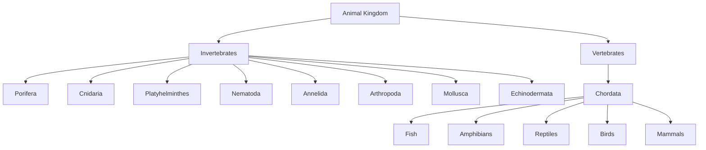

# 8.7 The Great Divide: Invertebrates and Vertebrates

"Our expedition through the animal kingdom has shown us incredible diversity—from the simple sponge to the clever octopus. But now, we arrive at a fundamental fork in the road, a division that separates the vast majority of animal life from the group to which we belong. This is the story of the backbone.

The first eight phyla we explored, from **Porifera** to **Echinodermata**, share a common trait: they are all **Invertebrates**. They are the pioneers of animal life, a sprawling, ancient assembly of creatures without an internal backbone. They are the architects of shells, exoskeletons, and soft, flexible bodies.

The final phylum, **Chordata**, introduces a revolutionary concept: an internal scaffold, a backbone. These are the **Vertebrates**. This single innovation allowed for greater size, speed, and the protection of a delicate central nervous system, paving the way for the evolution of fish, amphibians, reptiles, birds, and mammals.

While this division is more a matter of convenience than a formal taxonomic rank, it represents two profoundly different solutions to the challenge of life. Let's explore the fundamental differences between these two great assemblages of life."

---

## Comparing Two Worlds: Vertebrates vs. Invertebrates

The table below highlights the key distinctions that set vertebrates and invertebrates apart. It's a tale of two body plans, each successful in its own right.

| Feature                | ✅ **Vertebrates** (e.g., Humans, Fish, Birds)          | ❌ **Invertebrates** (e.g., Insects, Worms, Jellyfish) |
| ---------------------- | ----------------------------------------------------- | --------------------------------------------------------- |
| **Skeleton**           | Internal skeleton (endoskeleton) made of bone/cartilage | No internal skeleton; may have an external one (exoskeleton) |
| **Backbone**           | Present (vertebral column)                            | Absent                                                    |
| **Tail**               | Usually present at some stage                         | Absent (anus is typically at the posterior end)           |
| **Heart Position**     | Ventral (front side of the body)                      | Dorsal (back side), if present                            |
| **Nerve Cord**         | Dorsal (along the back), hollow, and single           | Ventral (along the belly), solid, and often paired        |
| **Limbs**              | Two pairs (e.g., arms and legs)                       | Three or more pairs, if present                           |
| **Haemoglobin**        | Contained within red blood cells                      | Dissolved directly in the blood, if present               |

***

*"So, while a beetle wears its skeleton on the outside and a human hides it on the inside, both are masterpieces of evolution. One is a story of external armor and adaptability, the other of internal strength and complexity. Two paths, one incredible kingdom."*

---

## 🗺️ Animal Kingdom Hierarchy: Mermaid Diagram

---

## 🧩 Summary Table: Animal Kingdom Hierarchy

| Level         | Group/Phylum         | Backbone?      | Example           |
|---------------|---------------------|----------------|-------------------|
| Kingdom       | Animalia            | Varies         | All animals       |
| Category      | Invertebrates       | No             | Insects, worms    |
| Phylum        | Porifera            | No             | Sponges           |
| Phylum        | Cnidaria            | No             | Jellyfish         |
| Phylum        | Platyhelminthes     | No             | Flatworms         |
| Phylum        | Nematoda            | No             | Roundworms        |
| Phylum        | Annelida            | No             | Earthworms        |
| Phylum        | Arthropoda          | No             | Butterflies       |
| Phylum        | Mollusca            | No             | Octopus           |
| Phylum        | Echinodermata       | No             | Starfish          |
| Category      | Vertebrates         | Yes            | Humans, fish      |
| Phylum        | Chordata            | Yes            | Mammals, birds    |
| Class         | Fish                | Yes            | Salmon            |
| Class         | Amphibians          | Yes            | Frogs             |
| Class         | Reptiles            | Yes            | Snakes            |
| Class         | Birds               | Yes            | Eagles            |
| Class         | Mammals             | Yes            | Humans            |

---
