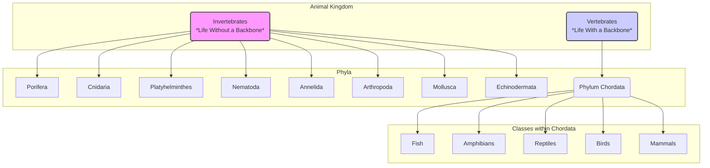

# 8.7 The Great Divide: Two Blueprints for Life

"In the rush of our daily lives, we rarely pause to consider the architecture of the life that surrounds us. We see a bird in the sky, a spider in its web, a fish in the water. But beneath the surface, nature has followed two grand blueprints to create this diversity. This is the story of the backbone—the fundamental divide between the world of the **Invertebrates** and the **Vertebrates**.

The first eight phyla we met are the **Invertebrates**, a sprawling, ancient assembly of creatures without an internal spine. Think of them as masters of external solutions—of shells, exoskeletons, and soft, fluid bodies. They are the silent majority of the animal kingdom.

Then there are the **Vertebrates**, the group to which we belong. They are built upon a revolutionary concept: an internal scaffold, the backbone. This single innovation allowed for greater size, speed, and the protection of a delicate nervous system, paving the way for the complex life that walks, swims, and flies across our planet.

Let's pause for a moment and appreciate these two profoundly different, yet equally successful, solutions to the challenge of existence."

---

## Comparing Two Worlds: Nature's Secret Rules

The table below is more than just a list of differences. It's a glimpse into the fundamental rules that govern how an animal is built.

| Feature                | ✅ **Vertebrates** (The Inner Fortress)                 | ❌ **Invertebrates** (The Outer Armor & The Free-form) |
| ---------------------- | ----------------------------------------------------- | --------------------------------------------------------- |
| **Skeleton**           | Internal skeleton (endoskeleton) of bone/cartilage    | No internal skeleton; may have an exoskeleton or be soft-bodied |
| **Backbone**           | **Present**—the central pillar of their design        | **Absent**—a defining characteristic                      |
| **Heart Position**     | Ventral (front of the body), a protected engine       | Dorsal (back of the body), if present                     |
| **Nerve Cord**         | Dorsal (along the back), hollow, and unified          | Ventral (along the belly), solid, and often paired        |
| **Haemoglobin**        | Held safely within red blood cells                    | Dissolved directly in the blood, if present               |

---

## 🗺️ Visualizing the Animal Kingdom's Two Great Paths

This diagram shows how the entire Animal Kingdom splits into these two major groups.

---

## 🧩 The Marvel of Creation: A Summary

| Group/Phylum         | Backbone? | Key Marvel & Innovation                               | Example           |
|----------------------|-----------|-------------------------------------------------------|-------------------|
| **Invertebrates**    | No        | **Masters of Adaptation:** Thriving without a spine.    | Insects, Worms    |
| Porifera             | No        | **The Simplest Animal:** A living, breathing water filter. | Sponges           |
| Cnidaria             | No        | **The Stinging Cell:** Nature's tiny harpoons.        | Jellyfish         |
| Platyhelminthes      | No        | **The First Hunters:** Simple, yet effective predators. | Flatworms         |
| Nematoda             | No        | **Ubiquity:** Found in nearly every ecosystem on Earth.| Roundworms        |
| Annelida             | No        | **Segmentation:** The power of a modular body plan.   | Earthworms        |
| Arthropoda           | No        | **The Exoskeleton:** A suit of armor for success.     | Butterflies       |
| Mollusca             | No        | **The Mantle:** A biological factory for shells.      | Octopus, Snails   |
| Echinodermata        | No        | **Five-Point Symmetry:** A unique radial body plan.   | Starfish          |
| **Vertebrates**      | Yes       | **The Internal Scaffold:** Enabling size, speed, and complexity. | Humans, Fish      |
| (Phylum Chordata)    | Yes       | **The Notochord:** The evolutionary blueprint for the backbone. | All Vertebrates   |
| └─ Fish              | Yes       | **Life in Water:** Gills and fins for aquatic dominance. | Salmon            |
| └─ Amphibians        | Yes       | **The Double Life:** Bridging the gap between water and land. | Frogs             |
| └─ Reptiles          | Yes       | **The Conquest of Land:** The amniotic egg.           | Snakes            |
| └─ Birds             | Yes       | **The Mastery of Flight:** Feathers and hollow bones. | Eagles            |
| └─ Mammals           | Yes       | **Warmth and Care:** Hair and mammary glands.         | Humans            |

---

***

*"So, the next time you see a beetle scurrying across the pavement or feel your own heartbeat, perhaps you'll remember these two stories. One, a tale of external armor and incredible adaptability; the other, of internal strength and conscious complexity. Both are masterpieces of evolution, and we are privileged to be a part of one, while living among the wonders of the other. It is a humbling, and beautiful, perspective."*

---
