# 🧬 Chapter 8: The Great Library of Life

"Imagine standing at the edge of a jungle teeming with millions of unknown creatures. Or stepping into a library with countless books, none of them sorted. This was the challenge faced by the pioneers of biology. For centuries, we saw the world in simple terms: there were plants, and there were animals. But where did a mushroom belong? What of the invisible world of bacteria, teeming in a single drop of water? The old maps were failing.

Then, in 1969, a biologist named R.H. Whittaker redrew the boundaries of life itself. He gave us a new chart, a new way of seeing, by proposing the **Five Kingdoms**. This wasn't just a new list; it was a revolution in understanding.

This chapter is your guide to that revolution. It is the story of how we learned to read the great library of life."

Think of it like your favorite music app. You have playlists for different moods—a "Workout" playlist, a "Chill Focus" playlist. Those are like **Species**. You might group those playlists into a larger folder called "My Playlists," which is like a **Genus**. All the music on the app belongs to genres like "Rock," "Pop," or "Classical"—those are the **Kingdoms**. Biological classification is our way of organizing the breathtaking diversity of life into a coherent system, revealing the hidden connections between every living thing.

---

## 🗺️ Your Expedition Guide: Table of Contents

Each section below is a stop on our journey. Explore them to uncover the secrets of classification.

| Section | The Adventure Within... |
| :--- | :--- |
| **[8.1 Introduction](8.1-introduction.md)** | Our journey begins. What does it mean to be a 'species', and how did the first explorers of life begin their monumental task? |
| **[8.2 Categories Higher than Species](8.2-categories-higher-than-species.md)** | Venture up the great ladder of life, from the familiar to the vast, and discover the nested worlds of Genus, Family, and Kingdom. |
| **[8.3 Drawbacks of Two Kingdom Classification](8.3-drawbacks-of-two-kingdom-classification.md)** | Investigate the mystery of the old system. Why did the simple world of 'plants and animals' fall apart? |
| **[8.4 Five Kingdom Classification](8.4-five-kingdom-classification.md)** | Witness the revolution. Meet the five great domains of life that brought a new order to our understanding. |
| **[8.5 Naming an Organism](8.5-naming-an-organism.md)** | Crack the secret code. Learn the universal language scientists use to name every living thing, from the mightiest whale to the most humble bacterium. |
| **[8.6 Major Groups of Animals](8.6-major-groups-of-animals.md)** | A safari through the animal kingdom's major blueprints, from the simple sponge to the complex chordate. |
| **[8.7 The Great Divide](8.7-invertebrata-and-vertebrata.md)** | Stand at the great fork in the animal road: the world of the invertebrates and the world of the vertebrates. |
| **[8.8 A Grand Tour of the Invertebrates](8.8-invertebrate-phylum-porifera-to-echinodermata.md)** | Meet the backbone-less wonders that rule the planet, from the architects of shells to the masters of the exoskeleton. |
| **[8.9 The Rise of the Vertebrates](8.9-phylum-chordata-vertebrata.md)** | Explore our own branch of the family tree and discover the five great classes of animals with backbones. |
| **[8.10 Questions](8.10-exam-practice.md)** | Test Your Knowledge |

---

## 🧭 Quick Navigation

**The Foundations:**
- **Start Here:** [8.1 Introduction](8.1-introduction.md)
- **The Big Idea:** [8.4 Five Kingdom Classification](8.4-five-kingdom-classification.md)
- **The Naming System:** [8.5 Naming an Organism](8.5-naming-an-organism.md)

**The Animal Kingdom:**
- **The Great Divide:** [8.7 Invertebrates vs. Vertebrates](8.7-invertebrata-and-vertebrata.md)
- **Invertebrate Tour:** [8.8 A Grand Tour of the Invertebrates](8.8-invertebrate-phylum-porifera-to-echinodermata.md)
- **Vertebrate Tour:** [8.9 The Rise of the Vertebrates](8.9-phylum-chordata-vertebrata.md)

---

## 🚀 A Final Thought

"The world is never the same once you have learned to see it this way. A walk in the park becomes a journey through kingdoms. A common insect becomes a marvel of arthropod engineering. This chapter gives you a new pair of eyes to see the grand, interconnected story of life that is unfolding all around us, every single day. The library is open. It is time to start reading."

---

## 🌳 The Grand Tree of Life: A Visual Tribute

Here is a visual map of the five great kingdoms, showing the beautiful, intricate order that governs the living world.

```mermaid
graph TD
    A(Living Beings) --> B(Kingdom Monera);
    A --> C(Kingdom Protista);
    A --> D(Kingdom Fungi);
    A --> E(Kingdom Plantae);
    A --> F(Kingdom Animalia);

    B --> B1(Archaebacteria);
    B --> B2(Eubacteria);

    C --> C1(Protozoa);
    C --> C2(Algae);
    C --> C3(Slime Molds);

    D --> D1(Zygomycota - Molds);
    D --> D2(Ascomycota - Sac Fungi);
    D --> D3(Basidiomycota - Mushrooms);

    E --> E1(Thallophyta - Algae);
    E --> E2(Bryophyta - Mosses);
    E --> E3(Pteridophyta - Ferns);
    E --> E4(Gymnosperms - Conifers);
    E --> E5(Angiosperms - Flowering Plants);

    F --> F1(Invertebrata);
    F --> F2(Vertebrata);

    F1 --> F1a(Porifera);
    F1 --> F1b(Coelenterata);
    F1 --> F1c(Platyhelminthes);
    F1 --> F1d(Nematoda);
    F1 --> F1e(Annelida);
    F1 --> F1f(Arthropoda);
    F1 --> F1g(Mollusca);
    F1 --> F1h(Echinodermata);

    F2 --> F2a(Pisces - Fish);
    F2 --> F2b(Amphibia - Amphibians);
    F2 --> F2c(Reptilia - Reptiles);
    F2 --> F2d(Aves - Birds);
    F2 --> F2e(Mammalia - Mammals);

```

